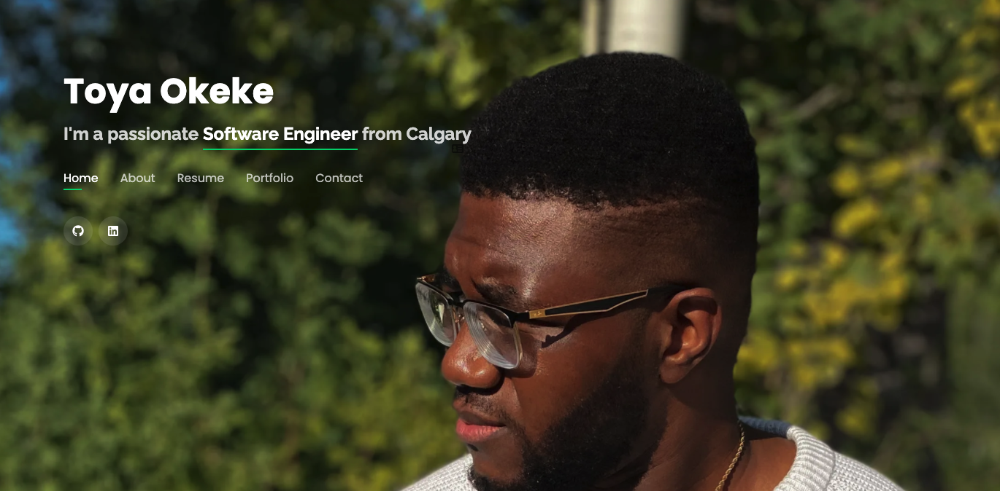

# [Toya Okeke](https://toyaokeke.github.io)

### Hi there 👋

Thanks for checking out my profile! My name is Toya and I'm a **Software Engineer** from Calgary. Feel free to check out some of my repositories 😄

### Background

- 🎓 M. Eng in Software Engineering @ [University of Calgary](https://ucalgary.ca)
- 🎓 B. Sc in Mechanical Engineering @ [University of Alberta](https://ualberta.ca)

<!--
**toyaokeke/toyaokeke** is a ✨ _special_ ✨ repository because its `README.md` (this file) appears on your GitHub profile.

Here are some ideas to get you started:

- 🔭 I’m currently working on ...
- 🌱 I’m currently learning ...
- 👯 I’m looking to collaborate on ...
- 🤔 I’m looking for help with ...
- 💬 Ask me about ...
- 📫 How to reach me: ...
- 😄 Pronouns: ...
- ⚡ Fun fact: ...
-->
